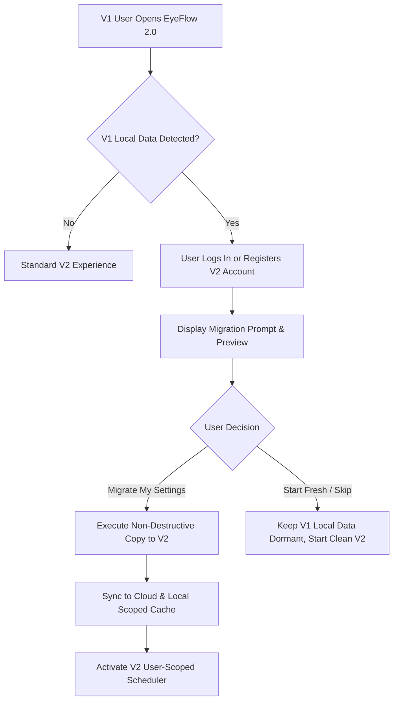

# EyeFlow V1 → V2 User Migration Plan & Architecture

## 1. Overview & Guiding Principles

EyeFlow V2 introduces multi-user authentication, cloud synchronization, and personal schedule isolation. To ensure seamless continuity without user disruption or accidental data alteration, the migration process is governed by three non-negotiable principles:

1. **Explicit (Opt-in Only)**: No automatic migration will occur silently in the background upon application startup. The user must be presented with an explicit migration option upon logging in or registering a V2 account.
2. **Safe (Read-Only Source)**: Migration is strictly **copy-based**. V1 local storage keys (`waterConfig`, `screenBreakConfig`, `generalSettings`, `notificationSettings`, `water_logs`, `screen_logs`) remain completely untouched and unmodified.
3. **Reversible (Full Rollback)**: If a user wishes to disconnect or revert to local V1 state, they can unbind their account, log out, and continue using V1 without data loss or corruption.

---

## 2. V1 to V2 Data Mapping Specification

| Domain | V1 Source (Local / IndexedDB) | V2 Target (User Scoped DB & Local Cache) | Transformation / Normalization |
|---|---|---|---|
| **Water Reminder** | `waterConfig` | `water_configurations` table / `usr_{userId}:waterConfig` | • Map `startTime`, `endTime` • Map `intervalMinutes` • Map `durationMinutes` → `duration_seconds` (* 60) • Map `activeDays` • Retain `quietHours` |
| **Look Outside** | `screenBreakConfig` | `look_outside_configurations` table / `usr_{userId}:screenBreakConfig` | • Map `startTime`, `endTime` • Map `screenIntervalMinutes` → `interval_minutes` • Map `breakDurationMinutes` → `duration_seconds` (* 60) • Map `activeDays` |
| **General Settings** | `generalSettings` | `user_settings` table / `usr_{userId}:generalSettings` | • Map `theme` ('dark', 'light', 'system') • Map `timeFormat` ('12h', '24h') • Map `soundEnabled`, `soundFile` • Map `startOnStartup` |
| **Notifications** | `notificationSettings` | `user_settings` table / `usr_{userId}:notificationSettings` | • Map `notifications_enabled` • Map notification preferences |
| **Reminder History** | `water_logs`, `screen_logs` | `reminder_events` table / `usr_{userId}:water_logs` | • Associate each past record with authenticated `user_id` • Preserve original `scheduledTimestamp`, `completedAt`, and `status` |
| **Statistics** | Derived from V1 logs | `getUserStatistics(userId)` | • Recalculated dynamically from user-scoped events |

---

## 3. Migration Workflow & User Experience

### User Migration Steps:
1. **Detection**: Upon login, `V1MigrationService.detectV1Data()` inspects local storage for existing V1 keys.
2. **Preview**: If V1 data exists, the user is shown a summary:
   - "We found existing settings on this device (Water interval: 45m, Look Outside: 20m, 34 completed breaks)."
3. **Confirmation**: User clicks **"Import to My Account"**.
4. **Execution**: Settings and historical logs are mapped and upserted under the authenticated `userId`.
5. **Preservation**: Original V1 keys remain in storage as an immutable fallback.

---

## 4. Rollback & Disaster Recovery Strategy

If an imported configuration causes unwanted behavior or the user prefers offline-only standalone mode:
- **Instant Rollback**: The user clicks **"Log Out"** or **"Revert to Device Settings"**.
- The V2 session is cleared, and the application immediately re-anchors to the untouched V1 local configuration.
- Zero local data is destroyed during the entire lifecycle.
